  

<table>
  <tr>
    <td valign="centre"></td>
    <td valign="top"></td>
  </tr>
</table>

<!-- HERO SECTION -->

  <h3><strong>Senior Platform Engineer & SRE | 11+ Years in Mission-Critical Systems</strong></h3>
  
<i>Building reliable, scalable, and observable systems, and automating everything from deployments to incident recovery.</i>

  

    
    
    
    
  

  

 

<!-- ================= ABOUT ME ================= -->
<h2 align="center">🚀 About Me</h2>

<table width="100%" border="0">
<tr>
<td width="50%" valign="top" style="border: none; background: none;">

### 👨‍💻 Who am I?

* 🏦 **Senior Platform Engineer / SRE** at **Fidelity International**, keeping trading systems reliable.
* ⚙️ **11+ years** across financial services, e-commerce, and cloud platforms: Fidelity, Amazon, and Deutsche Bank.
* 📈 Practitioner of modern SRE: **SLIs, SLOs, error budgets, postmortems, and RCA.**
* 🤖 Automating toil with **Python, Airflow, Terraform, and CI/CD**, and building AI side projects for fun.
* 🌱 Currently exploring **Kubernetes at scale, GenAI on AWS, and Data Engineering with Snowflake.**

<blockquote>
  

    <i>"Hope is not a strategy. Automate it, measure it, and make it reliable."</i>
  

</blockquote>

</td>

<td width="50%" align="center" valign="middle" style="border: none; background: none;">

</td>
</tr>
</table>

---

<!-- ================= CERTIFICATIONS ================= -->

  

  
  
  
  
  
  
  

<table align="center" width="100%" border="0">
  <tr>
    <td align="center" width="50%" style="border: none; background: none;">
      
    </td>
    <td align="center" width="50%" style="border: none; background: none;">
      
    </td>
  </tr>
</table>

  

---

### 🏅 Achievements

- 🎯 **99.9% uptime** for Charles River OMS trading platform via monitoring & deployment automation
- 📉 **35% MTTR reduction** with a Grafana, ELK & CloudWatch observability stack
- 🤖 **40% less manual L2 workload** at Amazon through Python self-healing automation
- 🚀 **Release cycle: 2 days → 4 hours** with reusable Terraform & Jenkins modules
- 🔮 **30% better incident prediction** via an SLI/SLO data pipeline (Airflow + Snowflake)
- ☁️ Led early **on-prem → AWS** cloud migration initiative at Fidelity

<!-- SKILLS SHOWCASE -->
<h2>⚡ Tech Stack & Engineering Arsenal</h2>

<table width="100%" align="center">
  <tr>
    <td width="50%" valign="top">
      <h3>💻 Languages & Scripting</h3>
      
        
      <h3>☁️ Cloud Platforms</h3>
      
        
      <h3>🛠️ DevOps & Infrastructure</h3>
      
        
      <h3>📊 Monitoring & Observability</h3>
      
        
      <h3>🗄️ Data & Databases</h3>
      
        
      <h3>🔧 Tools & OS</h3>
      
    </td>
    <td width="50%" valign="top">
      <h3>📈 SRE & Reliability</h3>
      
SLIs/SLOs • Error Budgets • Incident Management • Postmortems • Root Cause Analysis • Reliability Automation • On-call Runbooks • Self-Healing Systems

       
      <h3>🔄 Data Pipelines & Scheduling</h3>
      

        
        
         ETL Pipelines • Control-M • Autosys • Charles River Data Integration • Automated Reporting
      

       
      <h3>👀 Observability Stack</h3>
      

        
        
         Grafana • ITRS Geneos • Alerting • Dashboards • Incident Response Workflows
      

       
      <h3>🏗️ Infrastructure as Code</h3>
      
Terraform • CloudFormation • Reusable Multi-Environment Modules • AWS (EC2, RDS, IAM, S3) • Azure AKS • GCP Cloud Run

       
      <h3>🤖 AI & Side Projects</h3>
      
Generative AI • AWS AI Services • Streamlit • Python Automation • Electron • Mobile Apps (Kotlin, Swift)

    </td>
  </tr>
</table>

<!-- PROJECTS -->
<h2>💼 Featured Projects</h2>

<table width="100%">
  <tr>
    <td width="50%" valign="top">
      <h3>📊 SRE Data Pipeline Automation</h3>
      
Automated pipeline that collects, transforms, and visualizes reliability metrics (SLIs/SLOs), improving incident prediction accuracy by 30%.

      

        <code>Python</code> <code>Airflow</code> <code>Snowflake</code> <code>Grafana</code>
      

      <ul>
        <li>✔ Automated SLI/SLO Metric Collection</li>
        <li>✔ Reliability Dashboards & Trend Analysis</li>
      </ul>
    </td>
    <td width="50%" valign="top">
      <h3>🚀 CI/CD Standardization Initiative</h3>
      
Reusable Terraform and Jenkins modules for multi-environment deployments, cutting release cycle time from 2 days to 4 hours.

      

        <code>Terraform</code> <code>Jenkins</code> <code>AWS</code> <code>GitHub Actions</code>
      

      <ul>
        <li>✔ Reusable Multi-Environment IaC Modules</li>
        <li>✔ Standardized Release Pipelines</li>
      </ul>
    </td>
  </tr>
  <tr>
    <td width="50%" valign="top">
      <h3>🧰 <a href="https://github.com/nadeemali001/DevTiles">DevTiles (ToolNest)</a></h3>
      
31 browser-based developer tools in one tab: JSON formatting, timezone conversion, encoding/decoding and more for everyday workflows.

      

        <code>JavaScript</code> <code>HTML</code> <code>CSS</code>
      

      <ul>
        <li>✔ 31 Client-Side Developer Utilities</li>
        <li>✔ Zero-Install, Single-Tab Experience</li>
      </ul>
    </td>
    <td width="50%" valign="top">
      <h3>❄️ <a href="https://github.com/nadeemali001/snowflake-etl-pipeline">Snowflake Weather ETL Pipeline</a></h3>
      
End-to-end containerized ETL pipeline to ingest, transform, and analyze weather data using real-world data engineering patterns.

      

        <code>Python</code> <code>Apache Airflow</code> <code>Snowflake</code> <code>Docker</code>
      

      <ul>
        <li>✔ Containerized Airflow Orchestration</li>
        <li>✔ Automated Ingest → Transform → Analyze</li>
      </ul>
    </td>
  </tr>
  <tr>
    <td width="50%" valign="top">
      <h3>📺 <a href="https://github.com/nadeemali001/LoFi-LiveStream-Server">LoFi LiveStream Server</a></h3>
      
Headless, self-hosted 24x7 LoFi livestream engine (ffmpeg → RTMP) with a control API.

      

        <code>JavaScript</code> <code>Node.js</code> <code>ffmpeg</code> <code>RTMP</code>
      

      <ul>
        <li>✔ Always-On Headless Streaming</li>
        <li>✔ REST Control API</li>
      </ul>
    </td>
    <td width="50%" valign="top">
      <h3>🎵 <a href="https://github.com/nadeemali001/LyricsFlow">LyricsFlow</a></h3>
      
Sync song lyrics with audio and export .lrc files, available as a desktop Mac app and on the web.

      

        <code>TypeScript</code> <code>Electron</code> <code>Web Audio</code>
      

      <ul>
        <li>✔ Timestamped Lyric Sync</li>
        <li>✔ .lrc Export, Desktop + Web</li>
      </ul>
    </td>
  </tr>
</table>

<!-- ENGINEERING EXPERIENCE -->
<h2>🚀 Engineering Experience</h2>

11+ years designing, operating, and automating production systems across financial services, e-commerce, and the cloud.

<table width="100%">
  <tr>
    <td width="50%" valign="top">
      <h3>🏦 Fidelity International</h3>
      
<b>Senior Platform Engineer / SRE</b> · Jan 2023 – Present

      <ul>
        <li>Monitoring, alerting & automation pipelines for trading systems (Python, Shell, Airflow)</li>
        <li>Observability stack with Grafana, ELK & CloudWatch: <b>MTTR ↓ 35%</b></li>
        <li>Charles River trading data → Snowflake ingestion for automated reporting</li>
        <li>Defined SLIs, SLOs & error budgets across trading applications</li>
      </ul>
    </td>
    <td width="50%" valign="top">
      <h3>📦 Amazon India</h3>
      
<b>DevOps Engineer (Support Engineer III)</b> · Mar 2022 – Jan 2023

      <ul>
        <li>Production reliability for large-scale e-commerce with CI/CD, AWS & Terraform</li>
        <li>Python self-healing scripts: <b>manual L2 workload ↓ 40%</b></li>
        <li>Build & deploy pipelines with Jenkins and GitHub Actions</li>
        <li>CloudWatch dashboards & alarms for proactive anomaly detection</li>
      </ul>
    </td>
  </tr>
  <tr>
    <td width="50%" valign="top">
      <h3>🏦 Fidelity International</h3>
      
<b>Senior Analyst Programmer</b> · Feb 2018 – Mar 2022

      <ul>
        <li>Reliability & release pipelines for research systems serving portfolio managers</li>
        <li>Led early cloud-native adoption: on-prem → AWS migration</li>
        <li>Automated data refresh & testing with Python and Control-M</li>
        <li>Continuous improvement via postmortems & RCA</li>
      </ul>
    </td>
    <td width="50%" valign="top">
      <h3>🏛️ Deutsche Bank (HCL Tech)</h3>
      
<b>Software Engineer</b> · Dec 2014 – Jan 2018

      <ul>
        <li>Supported & enhanced trading applications (Imagine DB) for uptime and data integrity</li>
        <li>Automated incident reporting pipelines with SQL & Shell</li>
        <li>Worked with global SRE & dev teams on reliability SLAs</li>
      </ul>
    </td>
  </tr>
</table>

<!-- GITHUB STATS -->
<h2>📈 GitHub Analytics & Open Source Activity</h2>

  
  

  

    
  

  

    
  

  

    
  

